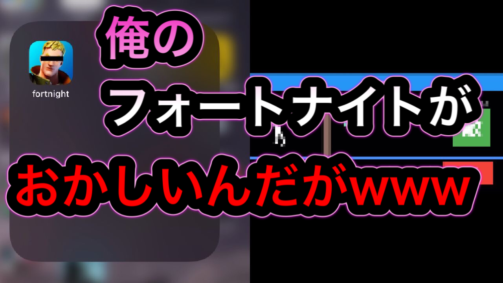

# フォー！とNight

[「【登録者300人突破記念】俺の「フォートナイト」がちょっとおかしんだがwww」企画](https://www.youtube.com/watch?v=hVU7ARR6YxI)

[](https://www.youtube.com/watch?v=hVU7ARR6YxI)<br>
<br>

・YouTubeチャンネル<br>
[貧乏エンジニア社長もくもくさん](https://www.youtube.com/c/mokudev)

チャンネル登録よろしくお願いしますm(__)m

## 設計

クロスプラットフォームフレームワークのFlutterで開発しました。

ゲームプラグインは Flame です。

設計書 T.B.D

## 使い方

Flutter SDK 1.22.3(stable)で確認済みです。

```sh
$ flutter doctor
[✓] Flutter (Channel stable, 1.22.3, on Mac OS X 10.15.7 19H2, locale ja-JP)
```

Flutter SDKとそれをビルドできるIDEが必要です。

[https://flutter.dev/docs/get-started/install](https://flutter.dev/docs/get-started/install)

### 実行

```sh
# Clone source code.
$ git clone https://github.com/hukusuke1007/fortnight.git
$ cd fortnight

# Install plugins.
$ flutter pub get

# Launching with debug version.
$ flutter run

# Launching with release version.
$ flutter run --release

# Launching both iOS and Android with debug version.
$ flutter run -d all
```

## その他

コードはご自由にお使いください。<br>
但し、このアプリをそのままストアへリリースすることはやめてください。

PRを受け付けています（笑）

## 素材

[フリー効果音　On-Jin ～音人～](https://on-jin.com/)

[効果音ラボ](https://soundeffect-lab.info/)

[フリーBGM（音楽素材）無料ダウンロード｜DOVA-SYNDROME](https://dova-s.jp/)